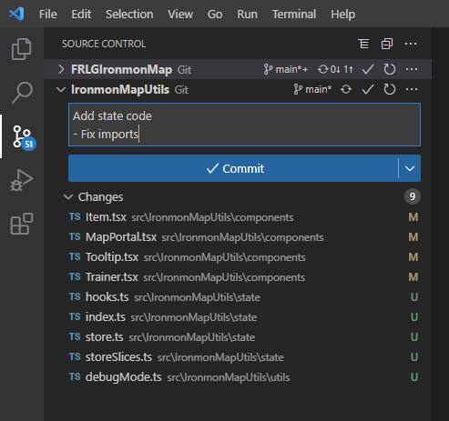

# IronmonMapUtils

This is a repo meant to be used as a submodule for the Ironman map apps

## Committing Changes

Changes can be made in two ways

1. Contribute to this repo directly
2. Make changes to the repo while using it as a submodule

For the latter case, changes can be easily seen in a VSCode window



## Getting the latest code from the repo into a submodule

For repos that are using this code as a submodule, you can get the latest code at the same time you are pulling the latest from the parent repo. The command to update the IronmonMapUtils files to the latest from `main` at the same time is:

```
git pull --recurse-submodules
```

## Using this repo as a submodule

To start using IronmonMapUtils as a submodule in a repo, run (in the folder you want this submodule to live)

```
git submodule add -b main https://github.com/kelseyyoung/IronmonMapUtils
git submodule init
```
